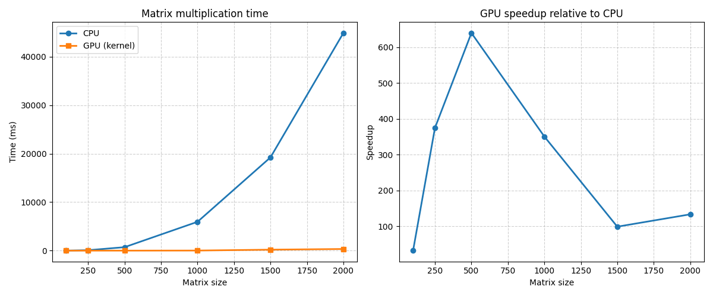

# Лабораторная работа №1. Перемножение матриц

## Стэк 

- C++
- NVIDIA CUDA 12.8
- Visual Studio 2022

## Описание реализации

В рамках лабораторной работы реализовано умножение квадратных матриц на языке C++ двумя способами: с использованием последовательного алгоритма на CPU и параллельного алгоритма на GPU с применением технологии CUDA. 

На CPU использован классический алгоритм умножения матриц с тройным вложенным циклом: внешний цикл проходит по строкам результирующей матрицы, второй - по столбцам, а внутренний цикл выполняет суммирование произведений соответствующих элементов строки первой матрицы и столбца второй матрицы. Каждый элемент результирующей матрицы вычисляется последовательно, что приводит к вычислительной сложности O(N³).

На GPU реализация основана на распараллеливании вычислений: каждый поток CUDA отвечает за вычисление одного элемента результирующей матрицы. Для этого используется двумерная конфигурация блоков и сетки потоков (grid и block), где координаты потока определяют позицию элемента (строку и столбец), который он вычисляет. Поскольку вычисления отдельных элементов независимы, эффективно распределяется работа между большим количеством потоков и значительно ускоряется выполнение.

Корректность результатов проверялась сравнением значений, полученных на CPU и GPU, с учётом допустимой погрешности вычислений с плавающей точкой (столбец `Verification` таблицы).

Измерение времени выполнения на CPU выполнялось с использованием библиотеки `std::chrono`, фиксируя момент начала и окончания вычислений. Для GPU время измерялось с помощью CUDA events для точного определения времени выполнения ядра без учёта накладных расходов на передачу данных между оперативной памятью и памятью видеокарты.

Проведено сравнение времени выполнения для различных размеров матриц, а также рассчитано ускорение, достигаемое за счёт параллельной обработки данных на GPU.

### Параллелизация на GPU

В GPU-реализации распараллелено вычисление элементов результирующей матрицы. Каждый поток CUDA отвечает за вычисление одного элемента C[i][j].

Такой способ выбран, потому что вычисление каждого элемента результирующей матрицы является независимым от других: для его получения требуется только соответствующая строка первой матрицы и столбец второй матрицы. Между вычислениями элементов отсутствуют зависимости по данным.

Назначение одного потока на один элемент позволяет максимально эффективно использовать архитектуру GPU, которая оптимизирована для выполнения большого количества однотипных операций параллельно. Данная схема упрощает реализацию и обеспечивает равномерное распределение вычислительной нагрузки между потоками.

По результатам экспериментов можно увидеть значительное ускорение при GPU-реализации по сравнению с последовательной реализацией на CPU.

## Результаты экспериментов

| Size | CPU (ms) | GPU kernel (ms) | Speedup | Verification |
|------|---------|----------------|---------|--------|
| 100  | 7.031   | 0.217          | 32.390  | OK     |
| 250  | 89.882  | 0.240          | 375.161 | OK     |
| 500  | 711.043 | 1.111          | 640.035 | OK     |
| 1000 | 5943.623| 16.939         | 350.876 | OK     |
| 1500 | 19221.237 | 193.707      | 99.228  | OK     |
| 2000 | 44882.799 | 335.682      | 133.706 | OK     |

**Графики с временем и ускорением CPU и GPU:**

## Выводы

- При увеличении размера матриц GPU показывает значительное ускорение по сравнению с CPU.
- Основное ускорение достигается за счёт параллельного вычисления элементов матрицы.
- На малых размерах влияние накладных расходов может снижать эффективность GPU.
- На больших размерах возможны ограничения, связанные с пропускной способностью памяти.

