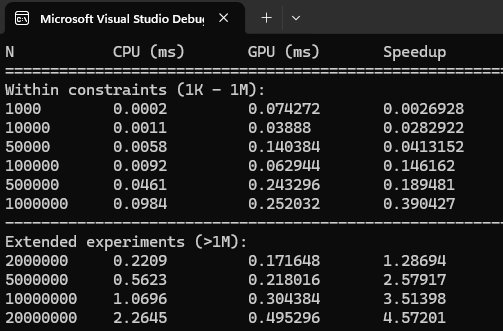
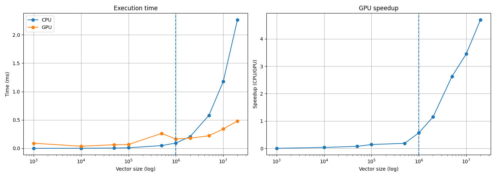

# Лабораторная работа №2. Сумма элементов вектора

## Стэк 

- C++
- NVIDIA CUDA 12.8
- Visual Studio 2022

## Описание реализации

В рамках лабораторной работы реализовано суммирование элементов вектора двумя способами: последовательным алгоритмом на CPU и параллельным алгоритмом на GPU с использованием технологии CUDA.

На CPU использован простой последовательный алгоритм, в котором все элементы вектора обрабатываются в одном потоке с накоплением результата. Алгоритм имеет линейную сложность O(N) и эффективно использует кэш процессора.

На GPU реализация основана на параллельной редукции (parallel reduction). Входной вектор разбивается на блоки, и каждый поток CUDA обрабатывает отдельный элемент. Внутри блока используется shared memory для выполнения поэтапного суммирования значений.

Редукция выполняется итеративно: на каждом шаге количество активных потоков уменьшается вдвое, а значения суммируются попарно до получения частичной суммы блока. После выполнения ядра частичные суммы копируются на CPU и агрегируются в итоговый результат.

Корректность вычислений проверяется сравнением результатов CPU и GPU.

Измерение времени на CPU выполняется с использованием  `std::chrono`.
Для GPU используется механизм CUDA events, позволяющий точно измерить время выполнения ядра без учёта накладных расходов на выделение памяти и передачу данных.

### Параллелизация на GPU

В GPU-реализации распараллелена операция суммирования элементов вектора с использованием алгоритма параллельной редукции (parallel reduction).

На первом этапе каждый поток CUDA загружает один элемент входного массива из глобальной памяти в shared memory блока. Если индекс потока выходит за границы массива, используется значение 0, чтобы корректно обрабатывались неполные блоки.

Далее внутри каждого блока выполняется редукция: на каждой итерации количество активных потоков уменьшается вдвое. Потоки с индексами меньше текущего шага (`stride`) суммируют своё значение со значением соседнего элемента в shared memory. После каждой итерации выполняется синхронизация потоков (`__syncthreads()`), обеспечивающая корректность доступа к данным.

В результате редукции каждый блок вычисляет частичную сумму, которая записывается в глобальную память. После завершения работы ядра все частичные суммы копируются на CPU, где выполняется финальное агрегирование в итоговый результат.

Данный подход выбран, поскольку операция суммирования элементов является ассоциативной и допускает разбиение на независимые подзадачи. Так, эффективно распаралелливаются вычисления и задействуется большое количество потоков GPU.

Использование shared memory позволяет существенно сократить количество обращений к медленной глобальной памяти, так как промежуточные результаты хранятся в быстром локальном кеше блока.

## Результаты экспериментов

Были проведены основные эксперименты с ограничениями для входных данных из задания и дополнительные эксперименты для отслеживания ускорения GPU-реализации.

**Графики с временем и ускорением CPU и GPU:**

## Выводы

- В диапазоне входных данных от 1 000 до 1 000 000 элементов использование GPU не даёт ускорения по сравнению с CPU. Это связано с накладными расходами на выделение памяти, передачу данных и запуск CUDA-ядра.
- CPU показывает высокую эффективность на малых объёмах данных благодаря оптимизациям компилятора и работе кэш-памяти.
- При увеличении размера входных данных (свыше 1 000 000 элементов) наблюдается рост производительности GPU.
- Максимальное ускорение в основных экспериментах достигает ~0.39 при размере 1 000 000 элементов.
- Начиная примерно с 2 000 000 элементов GPU начинает демонстрировать ускорение.
- Максимальное ускорение в дополнительных экспериментах достигает ~4.6x при размере 20 000 000 элементов.
- Использование GPU оправдано при обработке больших объёмов данных, где параллельная обработка компенсирует накладные расходы.

