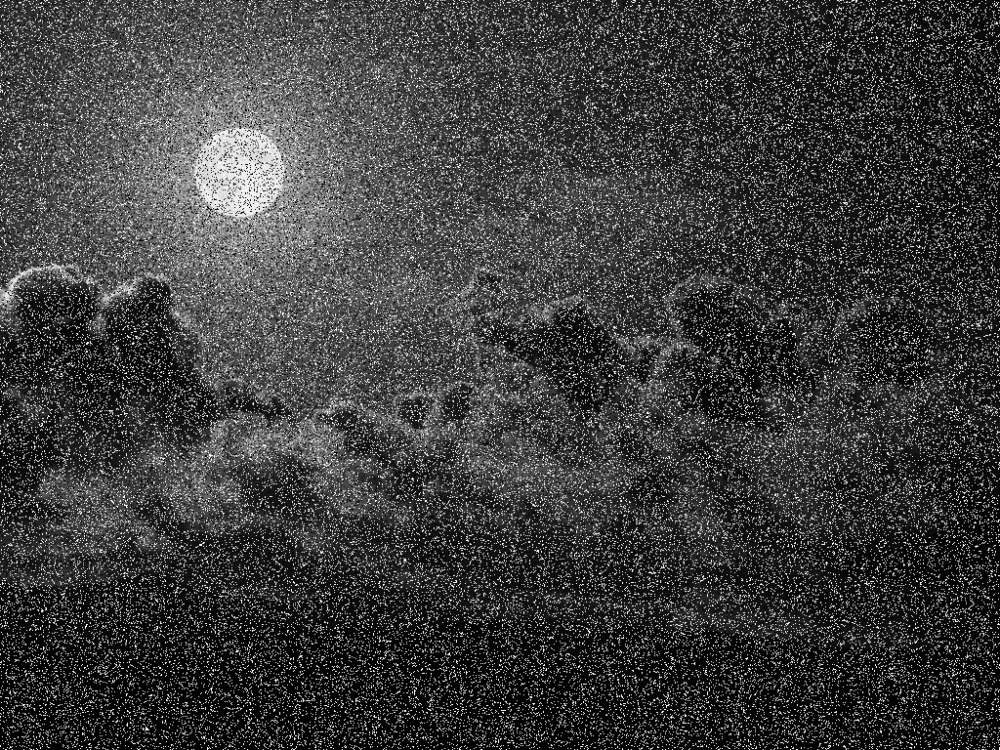
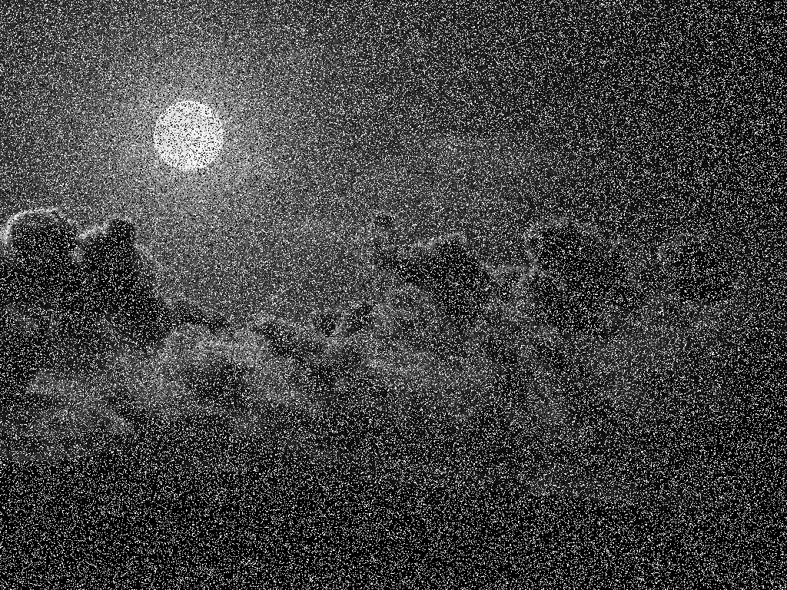

# Лабораторная работа №3. Salt-and-pepper noise filtering on GPU

## Описание

В проекте реализован медианный фильтр 3×3 на GPU с использованием CUDA и texture memory для удаления импульсного шума (salt & pepper) с изображений.

Программа:
- загружает BMP изображение;
- добавляет шум Salt & Pepper;
- выполняет медианную фильтрацию на GPU;
- сохраняет результат;
- вычисляет метрики качества изображения.

## Технологии

* C++
* CUDA
* EasyBMP

## Работа программы

Общая последовательность обработки:

1. Загрузка исходного изображения.
2. Преобразование изображения в оттенки серого.
3. Добавление шума Salt & Pepper.
4. Передача изображения в память GPU.
5. Выполнение медианной фильтрации CUDA-ядром.
6. Копирование результата обратно на CPU.
7. Сохранение обработанного изображения.
8. Расчёт метрик качества.


## Реализация

Программа загружает BMP-файл, считывает значения пикселей и преобразует изображение в оттенки серого. Значения яркости сохраняются в одномерный массив, который далее передаётся для обработки на GPU.

Перед фильтрацией к изображению добавляется шум типа Salt & Pepper. Данный шум случайным образом заменяет часть пикселей на значения `0` и `255`, что соответствует чёрным и белым точкам на изображении. Процент зашумления задаётся параметром программы.

Пример запуска генерации шума:

```bash
noise clean.bmp noisy.bmp 0.1
```

где `0.1` соответствует 10% зашумлённых пикселей.

Основная обработка изображения выполняется CUDA-ядром:

```cpp
__global__ void medianFilterKernel(...)
```

Каждый поток CUDA обрабатывает один пиксель изображения. Для текущего пикселя формируется окно размером `3×3`, содержащее значения соседних пикселей. Полученные значения сохраняются в локальный массив из 9 элементов, после чего массив сортируется и выбирается медианное значение.

Полученная медиана записывается в выходное изображение. Использование медианного фильтра позволяет эффективно удалять импульсный шум при сохранении границ объектов.

Для чтения изображения используется texture memory CUDA. Чтение выполняется через:

```cpp
tex2D<unsigned char>()
```

Texture memory обеспечивает кэширование данных и оптимизированный доступ к соседним пикселям, что повышает производительность фильтрации.

После завершения работы CUDA kernel результат копируется из памяти GPU обратно в память CPU и сохраняется в BMP-файл. 
Дополнительно вычисляются метрики качества изображения:
- MSE;
- PSNR.

Полученные значения используются для оценки эффективности удаления шума и качества восстановленного изображения.


## Экспериментальные результаты

Для проверки работы медианного фильтра были проведены эксперименты с различным уровнем шума 
Salt & Pepper: `5%`, `10%`, `15%`, `20%`, `25%` и `30%`.

Для каждого уровня шума:
- генерировалось зашумлённое изображение;
- выполнялась медианная фильтрация на GPU;
- измерялось время обработки;
- вычислялись метрики качества `MSE` и `PSNR`.

| Уровень шума | Время GPU, мс | MSE | PSNR, dB | Зашумленное изображение | После фильтрации |
|---:|---:|---:|---:|---|---|
| 5%  | `11` | `2.31625` | `44.483`  |  |  |
| 10% | `11` | `3.96602` | `42.1473` |  |  |
| 15% | `12` | `15.3456` | `36.271`  |  |  |
| 20% | `12` | `49.9764` | `31.1432` |  |  |
| 25% | `12` | `133.25`  | `26.8841` |  |  |
| 30% | `13` | `297.365` | `23.3979` |  |  |

Значение `MSE` показывает среднеквадратичную ошибку между исходным и восстановленным изображением. Чем меньше 
значение `MSE`, тем лучше качество фильтрации.

Метрика `PSNR` характеризует отношение сигнал/шум. Более высокое значение `PSNR` соответствует более качественному 
восстановлению изображения.

По результатам экспериментов видно, что медианный фильтр эффективно удаляет шум Salt & Pepper при небольшом уровне 
зашумления. При увеличении процента шума значения `MSE` возрастают, а `PSNR` уменьшается, что указывает на постепенное 
ухудшение качества восстановленного изображения. При этом время обработки на GPU остаётся практически постоянным.